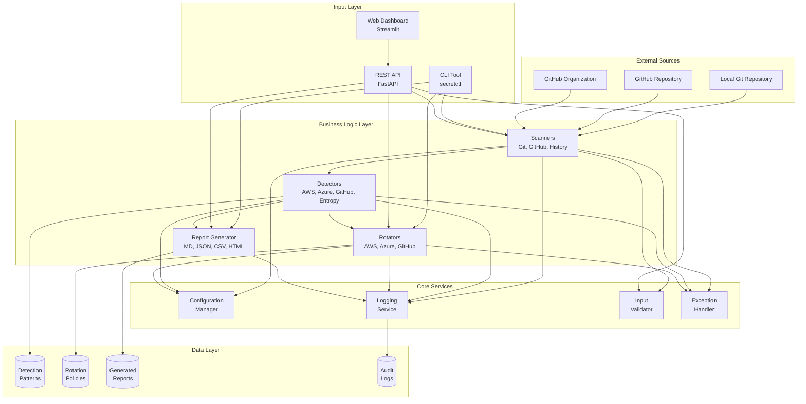
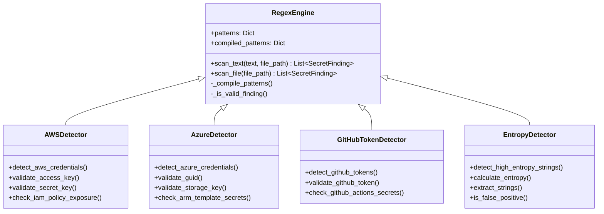
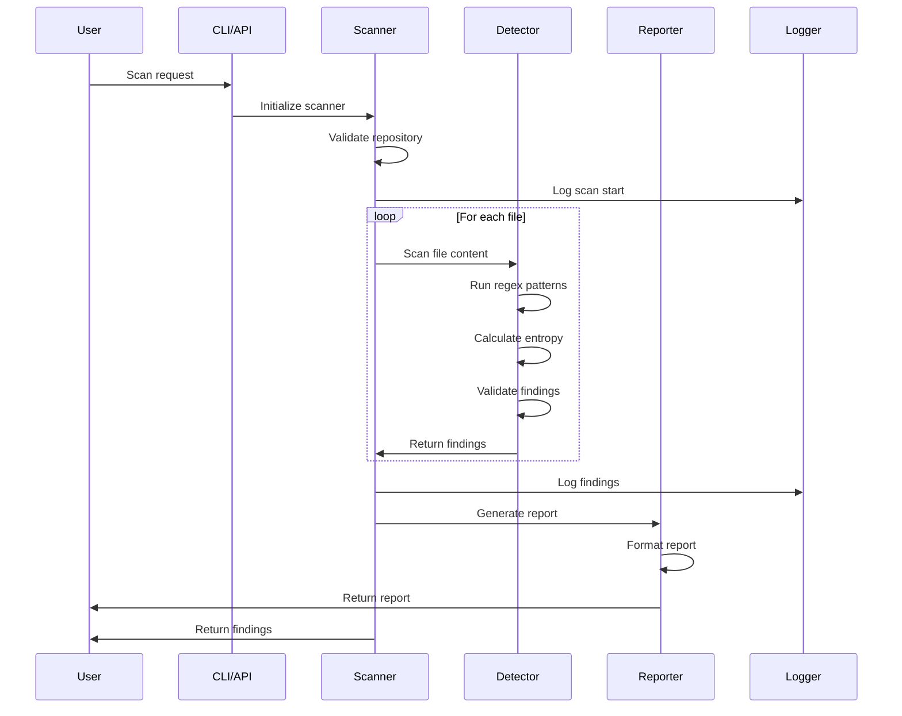
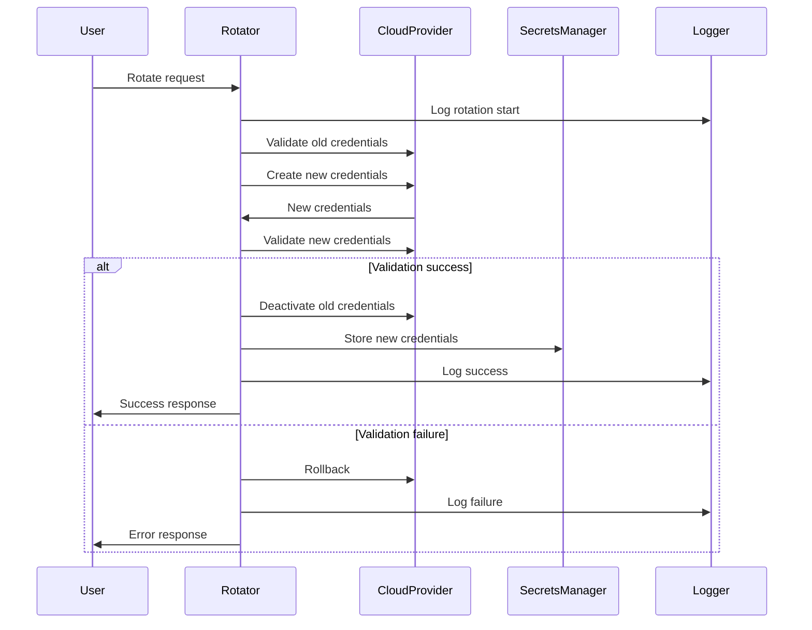

# 🏗️ Architecture Documentation

## Overview

The Secret Detection & Rotation Framework is built using clean architecture principles, emphasizing separation of concerns, testability, and maintainability.

---

## 🎯 High-Level Architecture



---

## 🔧 Component Architecture

### 1. Detection Engine



### 2. Scanning Flow



### 3. Rotation Flow



---

## 📦 Module Design

### Core Modules

#### **exceptions.py**
Purpose: Centralized exception handling
- Base exception: `SecretFrameworkError`
- Specific exceptions for each failure mode
- Structured error messages with context

#### **logging_config.py**
Purpose: Production-grade logging
- Secret masking formatter
- Structured logging (JSON/text)
- Rotating file handlers
- Separate audit logging
- Multiple log levels

#### **config_manager.py**
Purpose: Configuration management
- Environment variable loading
- JSON/YAML file loading
- Configuration validation
- Runtime configuration updates

#### **validators.py**
Purpose: Input validation
- Path validation (directory traversal prevention)
- Format validation (GitHub repo, AWS keys, etc.)
- Range validation (integers, lengths)
- Sanitization (string cleaning)

---

## 🔐 Security Architecture

### Defense in Depth

```
┌─────────────────────────────────────────┐
│         User Input Layer                │
│  • Input Validation                     │
│  • Sanitization                         │
│  • Rate Limiting                        │
└──────────────┬──────────────────────────┘
               │
┌──────────────▼──────────────────────────┐
│      Application Layer                  │
│  • Authentication                       │
│  • Authorization                        │
│  • Secret Masking                       │
│  • Audit Logging                        │
└──────────────┬──────────────────────────┘
               │
┌──────────────▼──────────────────────────┐
│       Data Layer                        │
│  • Encrypted Storage                    │
│  • Secure Configuration                 │
│  • Credential Isolation                 │
└─────────────────────────────────────────┘
```

### Security Layers
1. **Input Validation:** All inputs validated before processing
2. **Secret Masking:** Automatic masking in logs and outputs
3. **Audit Logging:** All security events logged
4. **Encryption:** TLS for transport, encryption at rest available
5. **Authentication:** OAuth2/JWT support
6. **Authorization:** RBAC-ready
7. **Rate Limiting:** Prevents abuse

---

## 🚀 Deployment Architecture

### Container Architecture

```
┌─────────────────────────────────────────────────────┐
│                   Load Balancer                      │
│              (nginx/ALB/Azure LB)                    │
└────────────┬────────────────────────┬────────────────┘
             │                        │
    ┌────────▼────────┐      ┌───────▼─────────┐
    │   API Service   │      │   Dashboard     │
    │   (Port 8000)   │      │   (Port 8501)   │
    │   [3 replicas]  │      │   [2 replicas]  │
    └────────┬────────┘      └─────────────────┘
             │
    ┌────────▼────────┐
    │  Redis Cache    │
    │  (Optional)     │
    └─────────────────┘
```

### Cloud Deployment Options

#### **AWS**
- ECS/Fargate for containers
- ALB for load balancing
- Secrets Manager for credentials
- CloudWatch for logging
- Parameter Store for configuration

#### **Azure**
- Container Instances or AKS
- Application Gateway for load balancing
- Key Vault for secrets
- Log Analytics for logging
- App Configuration for settings

#### **GCP**
- Cloud Run or GKE
- Cloud Load Balancer
- Secret Manager
- Cloud Logging
- Cloud Config

---

## 📊 Data Flow

### Secret Detection Flow

```
┌──────────┐
│   User   │
└────┬─────┘
     │
     ▼
┌──────────────┐
│  CLI/API     │  1. Parse request
└────┬─────────┘  2. Validate input
     │
     ▼
┌──────────────┐
│   Scanner    │  3. Fetch repository
└────┬─────────┘  4. Iterate files/commits
     │
     ▼
┌──────────────┐
│  Detector    │  5. Run regex patterns
└────┬─────────┘  6. Calculate entropy
     │            7. Filter false positives
     ▼
┌──────────────┐
│   Reporter   │  8. Format findings
└────┬─────────┘  9. Generate report
     │
     ▼
┌──────────────┐
│    User      │  10. Display/save results
└──────────────┘
```

### Credential Rotation Flow

```
┌──────────────┐
│ Detect       │  1. Secret detected
│ Secret       │
└────┬─────────┘
     │
     ▼
┌──────────────┐
│ Severity     │  2. Check severity
│ Check        │  3. Check policy
└────┬─────────┘
     │
     ▼
  Critical?
     │
     ├─Yes──▶┌──────────────┐
     │        │ Immediate    │  4. Rotate immediately
     │        │ Rotation     │
     │        └────┬─────────┘
     │             │
     └─No───▶     │
                  ▼
            ┌──────────────┐
            │ Validate     │  5. Create new credentials
            │ New Creds    │  6. Test new credentials
            └────┬─────────┘
                 │
                 ▼
            ┌──────────────┐
            │ Deactivate   │  7. Disable old credentials
            │ Old Creds    │  8. Update references
            └────┬─────────┘
                 │
                 ▼
            ┌──────────────┐
            │ Audit        │  9. Log rotation
            │ & Report     │  10. Notify stakeholders
            └──────────────┘
```

---

## 🧩 Design Patterns Used

### 1. **Strategy Pattern**
Different detection strategies (regex, entropy, context-aware)
```python
class DetectionStrategy(ABC):
    @abstractmethod
    def detect(self, text: str) -> List[Finding]:
        pass

class RegexStrategy(DetectionStrategy):
    def detect(self, text: str) -> List[Finding]:
        # Regex-based detection
        pass

class EntropyStrategy(DetectionStrategy):
    def detect(self, text: str) -> List[Finding]:
        # Entropy-based detection
        pass
```

### 2. **Factory Pattern**
Creating different types of scanners and rotators
```python
class ScannerFactory:
    @staticmethod
    def create_scanner(scan_type: str) -> Scanner:
        if scan_type == "local":
            return GitScanner()
        elif scan_type == "github":
            return GitHubScanner()
        # ...
```

### 3. **Builder Pattern**
Building complex reports with multiple formats
```python
class ReportBuilder:
    def __init__(self):
        self.report = Report()
    
    def add_findings(self, findings):
        self.report.findings = findings
        return self
    
    def add_statistics(self, stats):
        self.report.stats = stats
        return self
    
    def build(self) -> Report:
        return self.report
```

### 4. **Template Method Pattern**
Base scanner with customizable steps
```python
class BaseScanner(ABC):
    def scan(self):
        self.validate()
        files = self.fetch_files()
        findings = self.detect_secrets(files)
        return self.filter_findings(findings)
    
    @abstractmethod
    def fetch_files(self):
        pass
```

### 5. **Observer Pattern**
Logging and audit trail generation
```python
class ScanObserver:
    def on_scan_start(self, target):
        log_audit("SCAN_START", target=target)
    
    def on_secret_found(self, finding):
        log_detection(finding.type, finding.file, finding.severity)
    
    def on_scan_complete(self, findings):
        log_audit("SCAN_COMPLETE", count=len(findings))
```

---

## 📊 Technology Stack

### Core Technologies
- **Language:** Python 3.11+
- **Type Checking:** mypy
- **Testing:** pytest with coverage
- **Packaging:** setuptools + pyproject.toml

### Detection & Scanning
- **Git Operations:** GitPython
- **GitHub API:** PyGithub
- **Pattern Matching:** regex (enhanced)
- **Entropy Calculation:** Custom Shannon entropy

### Cloud Integration
- **AWS:** boto3 (IAM, Secrets Manager, SSM)
- **Azure:** azure-identity, azure-mgmt-*
- **GitHub:** PyGithub, JWT authentication

### User Interfaces
- **CLI:** Click (commands) + Rich (output)
- **API:** FastAPI + Pydantic + Uvicorn
- **Dashboard:** Streamlit + Plotly + Pandas

### Reporting & Templates
- **Templates:** Jinja2
- **Formats:** Markdown, JSON, CSV, HTML

### DevOps
- **Containers:** Docker + Docker Compose
- **CI/CD:** GitHub Actions
- **Linting:** Black, flake8, isort
- **Security:** Bandit, Safety, Trivy

---

## 🔄 Data Models

### SecretFinding

```python
@dataclass
class SecretFinding:
    secret_type: str          # e.g., "aws.access_key"
    secret_value: str         # The detected secret
    file_path: str            # Where it was found
    line_number: int          # Line number
    column: int               # Column number
    severity: str             # critical/high/medium/low
    description: str          # Human-readable description
    context: str              # Surrounding code
    commit_sha: Optional[str] # Git commit (if applicable)
    author: Optional[str]     # Commit author
    date: Optional[str]       # Detection date
    confidence: float         # Confidence score (0-1)
```

### Configuration

```python
class Config:
    patterns: Dict[str, Any]          # Detection patterns
    policies: Dict[str, Any]          # Rotation policies
    env: Dict[str, Any]               # Environment config
    thresholds: Dict[str, float]      # Detection thresholds
```

---

## 🔌 API Design

### REST API Endpoints

```
GET    /                         # Health check
POST   /scan/local               # Scan local repository
POST   /scan/github              # Scan GitHub repository
POST   /scan/organization        # Scan GitHub organization
POST   /rotate/aws               # Rotate AWS credentials
POST   /rotate/azure             # Rotate Azure credentials
POST   /rotate/github            # Rotate GitHub credentials
GET    /report/{report_id}       # Download report
GET    /jobs                     # List scan jobs
GET    /jobs/{job_id}            # Get job status
POST   /upload/scan              # Scan uploaded file
```

### Response Format

```json
{
  "status": "completed",
  "findings_count": 42,
  "findings": [...],
  "statistics": {
    "total_findings": 42,
    "by_severity": {
      "critical": 5,
      "high": 12,
      "medium": 20,
      "low": 5
    }
  },
  "scan_time": 12.5,
  "report_path": "/reports/scan_20240115.md"
}
```

---

## 🎨 CLI Design

### Command Structure

```
secretctl
├── scan
│   ├── local <path>              # Scan local repository
│   ├── github <owner/repo>       # Scan GitHub repository
│   └── org <organization>        # Scan organization
├── rotate
│   ├── aws <access-key>          # Rotate AWS credentials
│   ├── azure <sp-id>             # Rotate Azure credentials
│   └── github <type>             # Rotate GitHub credentials
├── report
│   ├── generate <input>          # Generate report
│   └── list                      # List reports
└── dashboard                      # Start dashboard
```

### Output Design
- **Rich formatting** with colors and styles
- **Progress indicators** for long operations
- **Tables** for structured data
- **JSON** output option for scripting
- **Exit codes** for CI/CD integration

---

## 🔍 Detection Algorithm

### Pattern-Based Detection

1. **Load Patterns** from `config/patterns.json`
2. **Compile Regex** patterns for efficiency
3. **Scan Text** line by line
4. **Match Patterns** against each line
5. **Check Context** for context-aware patterns
6. **Validate Format** (AWS key format, etc.)
7. **Filter False Positives** (examples, placeholders)
8. **Calculate Confidence** score
9. **Return Findings** with metadata

### Entropy-Based Detection

1. **Extract Strings** from text (quoted, assigned, etc.)
2. **Calculate Shannon Entropy** for each string
3. **Check Threshold** (default: 4.2)
4. **Check Context** for sensitive keywords
5. **Validate Length** (min: 20, max: 200)
6. **Filter False Positives** (hashes, UUIDs, paths)
7. **Calculate Confidence** based on characteristics
8. **Return High-Entropy Findings**

---

## 🔄 Rotation Strategy

### AWS IAM Rotation

```
1. Validate old access key format
2. Identify IAM user for key
3. Create new access key
4. Validate new key works (STS.get_caller_identity)
5. Deactivate old access key
6. Wait for propagation (5 seconds)
7. Delete old access key
8. Store new key in Secrets Manager
9. Update Parameter Store (if configured)
10. Log rotation event to audit trail
```

### Azure Service Principal Rotation

```
1. Validate service principal ID (GUID format)
2. Get service principal details
3. Generate new client secret (32 chars, secure)
4. Add new password credential to SP
5. Validate new credentials (get token)
6. Set expiry date (default: 90 days)
7. Remove expired old credentials
8. Store in Azure Key Vault
9. Log rotation event
```

### GitHub Token Rotation

```
1. Validate token format
2. Identify token type (PAT, OAuth, Deploy Key)
3. For PAT: Revoke via API (or mark for manual removal)
4. For Deploy Key: Generate new SSH key pair
5. For Webhook: Generate new secret
6. Update repository settings
7. Remove old credentials
8. Log rotation event
```

---

## 📈 Scalability Considerations

### Horizontal Scaling
- **Stateless Design:** No local state, can run multiple instances
- **Load Balancer:** Distributes requests across replicas
- **Shared Cache:** Redis for caching (optional)
- **Database:** PostgreSQL for persistence (optional)

### Performance Optimizations
- **Regex Compilation:** Patterns compiled once at startup
- **Lazy Loading:** Heavy modules loaded on demand
- **Caching:** Configuration cached in memory
- **Parallel Processing:** Multi-threaded scanning
- **Connection Pooling:** Reuse HTTP connections

### Resource Limits
- **Memory:** 512Mi request, 1Gi limit per pod
- **CPU:** 250m request, 1000m limit per pod
- **File Size:** Max 10MB per file scanned
- **Scan Depth:** Configurable commit limit

---

## 🛡️ Error Handling Strategy

### Exception Hierarchy

```
SecretFrameworkError (base)
├── DetectionError
│   └── PatternLoadError
├── ScanError
│   ├── RepositoryNotFoundError
│   └── InvalidRepositoryError
├── RotationError
│   ├── CredentialValidationError
│   └── RotationNotSupportedError
├── ValidationError
│   └── InvalidInputError
├── ConfigurationError
│   └── MissingConfigError
├── AuthenticationError
│   └── InvalidTokenError
└── APIError
    └── RateLimitError
```

### Error Handling Best Practices
1. **Specific Exceptions:** Use specific exception types
2. **Error Context:** Include details in exception
3. **Logging:** Log all errors with stack traces
4. **User Feedback:** Clear, actionable error messages
5. **Recovery:** Attempt recovery where possible
6. **Graceful Degradation:** Fail safely

---

## 📊 Monitoring & Observability

### Metrics to Monitor

**Application Metrics:**
- Secrets detected (by type, severity)
- Scan duration (p50, p95, p99)
- Rotation success/failure rate
- API request rate and latency
- Error rate by endpoint

**System Metrics:**
- CPU usage
- Memory usage
- Disk I/O
- Network I/O
- Container health

**Business Metrics:**
- Repositories scanned
- Findings by severity
- Time to rotation
- Compliance score

### Logging Strategy

**Levels:**
- DEBUG: Detailed execution flow
- INFO: Normal operations
- WARNING: Potential issues
- ERROR: Errors that need attention
- CRITICAL: System failures

**Structure:**
```json
{
  "timestamp": "2024-01-15T10:30:00Z",
  "level": "INFO",
  "name": "secret_framework.scanner",
  "message": "Scan completed",
  "module": "git_scanner",
  "function": "scan",
  "line": 123,
  "extra": {
    "target": "owner/repo",
    "findings": 42,
    "duration": 12.5
  }
}
```

---

## 🔮 Future Architecture Enhancements

### Phase 2 (Optional)
1. **ML-Based Detection:** Train models on known secret patterns
2. **Real-Time Monitoring:** WebSocket for live updates
3. **Distributed Scanning:** Job queue with workers
4. **Graph Database:** Neo4j for relationship mapping
5. **Time Series DB:** InfluxDB for metrics
6. **Message Queue:** RabbitMQ/Kafka for async processing

### Phase 3 (Advanced)
1. **Multi-Region Deployment:** Global CDN
2. **Advanced Analytics:** Data warehouse integration
3. **AI-Powered Recommendations:** GPT integration
4. **Mobile App:** iOS/Android clients
5. **Browser Extension:** Chrome/Firefox plugin

---

## 📚 References

- **Clean Architecture:** Robert C. Martin
- **Domain-Driven Design:** Eric Evans
- **RESTful API Design:** Roy Fielding
- **12-Factor App:** Heroku
- **OWASP:** Security best practices
- **Docker Best Practices:** Official Docker docs
- **Kubernetes Patterns:** Red Hat

---

**Document Version:** 1.0  
**Last Updated:** 2024-01-15  
**Maintainer:** Security Engineering Team

